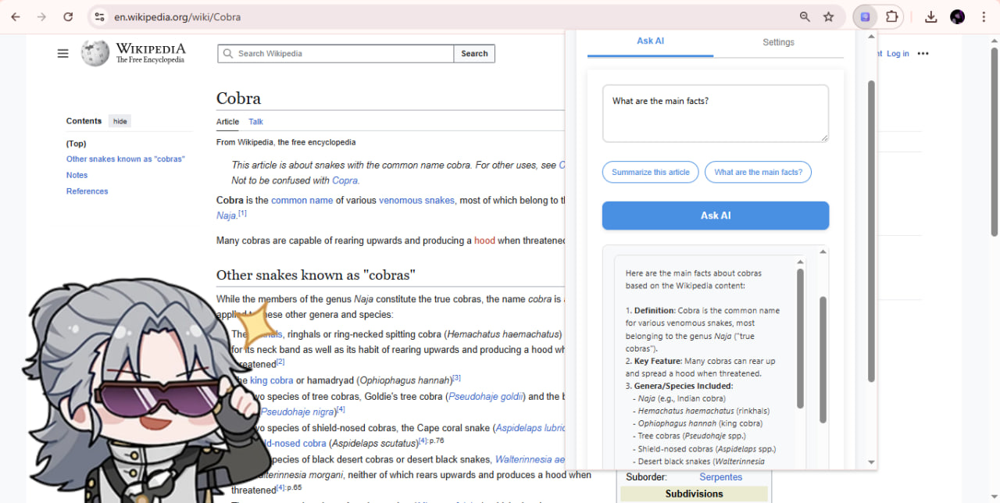

# AskPilot - AI-Powered Web Page Assistant

AskPilot is a Chrome browser extension that uses AI to answer questions about the content of any web page you're viewing. It intelligently extracts page content, filters out ads and promotional material, and provides contextual responses using various AI models through OpenRouter.

## Features

- 🤖 **AI-Powered Q&A**: Ask questions about any web page content
- 🧹 **Smart Content Filtering**: Automatically removes ads and promotional content
- 🎯 **Context-Aware Questions**: Pre-defined questions based on website type
- ⚙️ **Flexible AI Models**: Support for multiple AI models (Claude, GPT-4, Llama, etc.)
- 💾 **Export Responses**: Download AI responses in TXT, DOCX, or PDF format
- 🔒 **Secure API Key Storage**: Your OpenRouter API key is stored securely in Chrome

## Download & Installation

### Option 1: Download from Releases (Recommended)

1. Go to the [Releases page](https://github.com/bentex2006/AskPilot/releases)
2. Download the latest `AskPilot-v[version].zip` file
3. Extract the ZIP file to a folder on your computer
4. Open Chrome and navigate to `chrome://extensions/`
5. Enable "Developer mode" in the top right corner
6. Click "Load unpacked" and select the extracted extension folder
7. The AskPilot icon should appear in your Chrome toolbar

### Option 2: Clone Repository

1. Clone this repository: `git clone https://github.com/bentex2006/AskPilot.git`
2. Open Chrome and navigate to `chrome://extensions/`
3. Enable "Developer mode" in the top right corner
4. Click "Load unpacked" and select the extension folder
5. The AskPilot icon should appear in your Chrome toolbar

## Setup

### Getting an OpenRouter API Key

1. Visit [OpenRouter API Keys page](https://openrouter.ai/keys)
2. Create an account or log in
3. Generate a new API key
4. Copy the API key

### Configuring AskPilot

1. Click the AskPilot extension icon in Chrome
2. Go to the "Settings" tab
3. Paste your OpenRouter API key
4. Select your preferred AI model
5. Configure content filtering preferences
6. Click "Save Settings"

## Usage

1. Navigate to any web page
2. Click the AskPilot extension icon
3. Wait for "Page Content Loaded" status
4. Either:
   - Use one of the pre-defined questions
   - Type your own question in the text area
5. Click "Ask AI" to get a response
6. Copy or download the response as needed

## Supported AI Models

- **DeepSeek Coder** (Default) - Great for code analysis
- **Claude 3.5 Sonnet** - Excellent for detailed analysis
- **GPT-4o** - OpenAI's flagship model
- **Llama 3.1 70B** - Open-source alternative
- **Gemini Pro 1.5** - Google's advanced model

## File Structure

```
AskPilot/
├── manifest.json          # Extension configuration
├── popup.html             # Main extension popup interface
├── popup.css              # Styling for the popup
├── popup.js               # Main extension logic
├── content.js             # Content extraction from web pages
├── background.js          # Background service worker
├── onboarding.html        # Welcome/setup page
├── onboarding.css         # Onboarding page styles
├── onboarding.js          # Onboarding page logic
└── images/                # Extension icons
    ├── icon16.png
    ├── icon48.png
    └── icon128.png
```

## Key Features Explained

### Smart Content Extraction
The extension intelligently identifies main content areas using selectors like `article`, `main`, `.content`, etc., and falls back to body content if needed.

### Content Filtering
Automatically removes:
- Advertisements and sponsored content
- Navigation menus and sidebars
- Comments sections
- Social sharing buttons
- Cookie notices and popups

### Context-Aware Questions
Pre-defined questions adapt based on the website:
- **YouTube**: "Summarize this video", "What are the key points?"
- **Wikipedia**: "Summarize this article", "What are the main facts?"
- **E-commerce**: "What is this product?", "What are the features?"
- **GitHub**: "What does this code do?", "Explain the project"

## Permissions

The extension requires the following permissions:
- `storage`: To save your API key and settings
- `activeTab`: To access content from the current tab
- `<all_urls>`: To work on any website

## Privacy & Security

- Your API key is stored locally in Chrome's secure storage
- Page content is only sent to the selected AI model via OpenRouter
- No data is collected or stored by the extension developers
- All communication with AI services is encrypted

## Troubleshooting

### "Failed to load page content"
- Refresh the page and try again
- Some pages may block content extraction due to security policies

### "API key is missing"
- Go to Settings tab and enter your OpenRouter API key
- Make sure the API key is valid and has sufficient credits

### "API error" messages
- Check your OpenRouter account for sufficient credits
- Verify your API key is correct
- Try switching to a different AI model

## Development

### Building the Extension
This extension is built with vanilla JavaScript and doesn't require a build process. Simply load the folder as an unpacked extension in Chrome.

### Testing
1. Load the extension in Chrome Developer mode
2. Navigate to various websites
3. Test the Q&A functionality
4. Verify content filtering works correctly

## Contributing

1. Fork the repository
2. Create a feature branch
3. Make your changes
4. Test thoroughly
5. Submit a pull request

## License

This project is open source. Please check the repository for license information.

## Credits

Developed by Bentex - [GitHub Profile](https://github.com/bentex2006)

## Changelog

### Version 1.0
- Initial release
- Basic Q&A functionality
- Multiple AI model support
- Content filtering
- Export functionality
- Settings management
